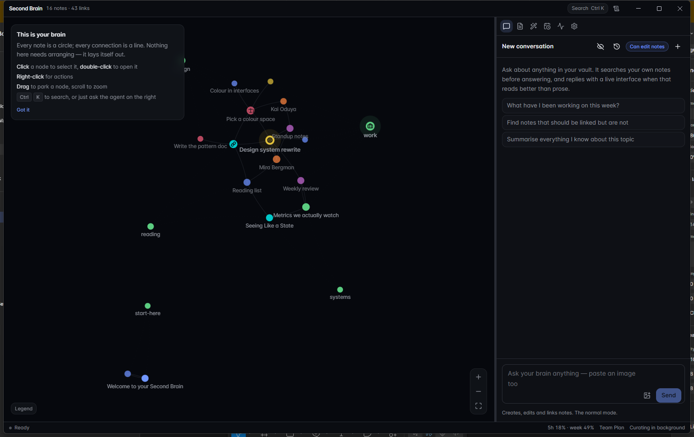

# Second Brain

A desktop knowledge base where a physics-driven graph of your notes is the main
screen, and an agent works alongside it — reading and writing your notes, connecting
them, answering with a live interface instead of a wall of text, and checking in on
its own when something is worth raising.

Notes are plain markdown on your own disk. Nothing is locked in.

Windows 10/11 and macOS 11 Big Sur or newer, on both Apple Silicon and Intel.



---

## What you need first

This app does not talk to an AI provider itself. It drives **your own**
[Claude Code](https://claude.com/claude-code) install as a subprocess:

- Install the `claude` CLI and sign in to it once, before opening the app.
- Everything the agent does draws on **that account's own limits**. There is no API
  key to paste anywhere, and no second bill — the footer shows how much of your
  current window is left.
- Anthropic auth and endpoint environment variables are deliberately stripped before
  the CLI starts, so the app cannot silently fall back to a key it inherited from
  the shell that launched it.

Without the CLI the app still opens and the graph still works, but the agent cannot
answer.

## Install

Grab an installer from [Releases](https://github.com/emre-aktas/second-brain/releases).

**Windows** — run the `Setup` installer, or use the portable `.exe`.

**macOS** — open the `.dmg` for your chip (`arm64` for Apple Silicon, `x64` for
Intel) and drag the app to Applications. These builds are ad-hoc signed but **not
notarized by Apple**, so the first launch is blocked: right-click the app and choose
**Open**, then confirm. Once only. If macOS still refuses:

```bash
xattr -dr com.apple.quarantine "/Applications/Second Brain.app"
```

### Updates

The installed Windows build keeps itself current. It checks for a new release a few hours at a
time, and when there is one a marker appears in the footer; opening it shows what changed and
one button downloads it, installs it and restarts the app. What's new is shown again on the way
back up, so an update never happens without saying what it did.

Two builds cannot replace themselves and are honest about it, offering the release page instead:
the portable `.exe`, which has no installation to replace, and macOS, where the ad-hoc signature
is one Squirrel.Mac refuses to update. Both still tell you a new version exists.

---

## What it does

**The graph is the home screen.** Every note is a circle, every connection a line,
and nothing needs arranging — it lays itself out. Colour is the family a note belongs
to and the glyph is its kind, because eight hues is the limit for telling colours
apart at 17px.

The layout is three-dimensional and turns slowly on its own, about two minutes to the
revolution — hold Shift and drag to orbit it yourself, and the turn picks up from
wherever you left it. Depth is carried by size, by opacity and by which lines are
drawn over which, so the near side of the graph is legibly nearer rather than merely
mathematically nearer. This is the one piece of ambient motion in the app and it is
there on purpose: a still graph is a diagram, and a graph that drifts is a thing you
are looking into. It can be switched off in Settings, which also stops the redraw.

Everything else moves only on meaningful events — a pulse when a note changes, a
camera tween when something is focused.

**Answers arrive as interfaces.** Ask for a comparison and you get a table; ask for a
breakdown and you get a chart. The agent emits a validated spec and the renderer maps
each block onto a real component, so nothing is ever eval'd and everything matches the
design system.

**Tools are built on request.** Ask for "a translator with a casual and a formal
button" and you get a saved tool with those buttons, its own document, and its own
window if you want one. The agent writes the interface as ordinary HTML and CSS inside
a sandboxed frame — so no two tools have to look alike — and each button runs a single
agent job against the tool's inputs.

**It works on its own clock.** The Scheduled tab holds anything recurring: "every
hour, scan Slack and compile what is new", "every weekday at nine, summarise
yesterday". Ask for it in conversation and it appears there. Every run gets its own
conversation, openable from the job's history — so a digest is a thread of digests
rather than one that grows for ever.

Alongside them is a check-in that decides for itself whether anything is worth
raising. Looking at your notes is free: a deterministic pre-check asks whether
anything actually changed, and most hours the answer is no and nothing is spent.
Looking *outside* your notes is not free, so that runs on a longer interval you
control, and only ever names connectors your Claude account actually has.

One switch turns all of it off, including your own jobs. An app that acts unprompted
has to be legible, so every job is listed with what it will do, when it goes next,
and every time it has run.

An unattended run can read the outside world but cannot write to it. Permissions are
pre-approved for a background turn — there is nobody to answer a prompt — so the
tools that would send a message on your behalf are denied outright.

**Notifications only when you are not looking.** A reply that lands while you are in
another window, a scheduled run with something to say, a question the agent is blocked
on. Never for something already on screen.

**Conversations run in parallel.** Starting a second one does not stop the first;
the history list shows which are still working.

---

## Your notes stay yours

A workspace is created at `Documents/Second Brain` on first launch:

```
vault/          your notes, as .md with YAML frontmatter
attachments/
integrations/   manifests and any code the agent writes
.brain/         SQLite index and logs — derived, safe to delete
.trash/         soft-deleted notes, never hard-deleted
```

`vault/` is the source of truth and the SQLite index is only a cache, rebuildable
from the files at any time. That is what makes it safe to open the same vault in
Obsidian, put it under git, or sync it however you like.

Two kinds of connection exist:

- `[[Wikilinks]]` in a note's body are part of the writing. They live in the file and
  are re-derived on every index.
- Edges the agent or the curator added live only in the index, tagged with their
  origin so re-indexing can never clobber them.

Linking to a note that does not exist yet is a feature: it shows up as a hollow node,
and when you eventually write it the note **inherits that node's identity**, so every
link already pointing at it stays intact.

Notes can also be given an expiry when they are written — a daily digest is worth
keeping for a week, not for ever. Expired notes move to `.trash/`, and pinned ones
are never touched.

---

## Architecture

```
src/shared/     types, the IPC contract, the Generated UI schema, schedule maths
src/main/       Electron main process
  db/           SQLite (WASM) — nodes, edges, FTS5, activity, chat, tools, tasks
  vault/        markdown parsing, file access, indexer, filesystem watcher
  agent/        claude CLI driver, tool host, MCP bridge, system prompt
  tasks/        the scheduler and the check-in's pre-check
  curator/      TF-IDF similarity and the idle-time background pass
src/preload/    the sandboxed bridge — an allowlist, nothing more
src/renderer/   React, Tailwind v4, shadcn/ui
  components/graph/   force worker + canvas renderer
  components/genui/   spec -> component renderer
  components/tools/   the sandboxed frame agent-written tools live in
```

---

## Development

```bash
npm install
npm run dev
```

```bash
npm run build      # compile main, preload and renderer
npm run typecheck  # tsc over both tsconfig projects
npm run verify     # the whole verification suite
npm run icons      # regenerate build/icon.{png,ico} and icon-mac.png
npm run dist       # installers for the platform you are on, into release/
npm run dist:win   # NSIS installer + portable .exe
npm run dist:mac   # .dmg and .zip, arm64 and x64
```

macOS artifacts have to be built on macOS — `.icns` generation and `codesign` only
exist there. `.github/workflows/release.yml` builds both platforms on a tag, and
`npm run release patch` is what makes the tag: it bumps the version, writes a
`CHANGELOG.md` section from the commits since the last release, and commits both. Read
what it wrote before pushing — the release body comes from it, and that body is what
every running copy of the app shows as the release notes.

```bash
git push origin main --follow-tags
```

### Verification

There is no test runner. Each check is a self-contained script that prints `ok`/`FAIL`
and exits non-zero, run through `scripts/run-ts.mjs`, which bundles one main-process
module with esbuild and runs it under the Electron runtime:

```bash
npm run verify              # everything that needs no Claude subscription
npm run verify -- --all     # plus the probes that drive the real claude CLI
```

Or one at a time. `--node` runs under plain Node; `--gui` needs a real
`BrowserWindow`, because those probes render offscreen and capture a PNG — looking at
the picture is the point:

```bash
node scripts/run-ts.mjs src/main/db/storage.test.ts --node
node scripts/run-ts.mjs src/shared/schedule.test.ts --node        # schedule arithmetic
node scripts/run-ts.mjs src/main/agent/lifecycle.probe.ts --node  # a stop vs. a crash
node scripts/run-ts.mjs src/main/codeTool.probe.ts --gui          # tools, dark and light
node scripts/run-ts.mjs src/main/agent/agent.probe.ts --node      # round trip, SPENDS USAGE
```

`agent.probe.ts` runs a real model turn against your account, which is why nothing
runs it automatically. Everything in `npm run verify` is free.

`npm run verify` also fails if any file under `src/` or `scripts/` is excluded by
`.gitignore` — an unanchored directory pattern once swallowed two source folders, and
a working tree that looks complete gives no hint of it.

## Licence

MIT. See [LICENSE](LICENSE).
